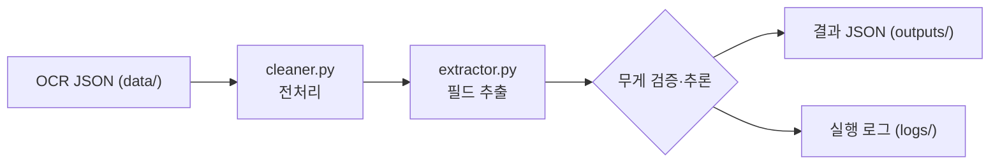

# reco-ocr-parser

계근지(차량 중량/공차/실중량 등을 포함한 영수증 형태)의 OCR 텍스트를 받아, 업무에 필요한 필드를 정확하고 견고하게 파싱해 구조화 JSON으로 저장하는 파이프라인입니다.

## TL;DR (빠른 실행)

```bash
# Git Bash (추천)
python -m venv venv
source venv/Scripts/activate
pip install -r requirements.txt
python main.py

# 결과 확인
cat outputs/sample_01_result.json
```

```powershell
# PowerShell
python -m venv venv
venv\Scripts\Activate.ps1
pip install -r requirements.txt
python .\main.py
```

테스트 실행
```bash
python -m pytest tests/ -v
```


## 프로젝트 구조

```
reco-ocr-parser/
├─ main.py                     # 파이프라인 실행 진입점
├─ requirements.txt            # 의존성 목록
├─ README.md                   # 프로젝트 문서
├─ data/                       # OCR 원본 JSON (입력, text 필드 사용)
│  ├─ sample_01.json
│  ├─ sample_02.json
│  ├─ sample_03.json
│  └─ sample_04.json
├─ src/
│  ├─ parser/
│  │  ├─ __init__.py
│  │  ├─ cleaner.py            # 전처리(노이즈/치환/공백 정규화)
│  │  ├─ extractor.py          # 필드 추출·검증 핵심 로직
│  │  ├─ rules.py              # 라벨/정규식/주소 접두 규칙
│  │  └─ extractor_nlp_wrapper.py # (옵션) NLP 보조 래퍼
│  ├─ utils/
│  │  ├─ __init__.py
│  │  └─ formatter.py          # 숫자 병합, 노이즈 판정, 수치 추출
│  └─ nlp/
│     └─ engine.py             # spaCy EntityRuler 엔진(지연 임포트)
├─ tests/
│  ├─ __init__.py
│  ├─ test_cleaner.py
│  └─ test_extractor.py
├─ outputs/                    # 파싱 결과 JSON (출력)
│  ├─ sample_01_result.json
│  ├─ sample_02_result.json
│  ├─ sample_03_result.json
│  └─ sample_04_result.json
├─ logs/
│  └─ pipeline.log             # 실행 로그
└─ docs/
   └─ INTERVIEW.md             # 설계/코드 분석/면접 대비 노트
```

## 환경 및 의존성

- Python: **3.10** 이상(개발/검증 3.10.11)
- OS: Windows / macOS / Linux

필수 패키지(버전은 `requirements.txt` 기준)
- spacy 3.7.2: (옵션) EntityRuler 보조용
- pandas 2.1.3, pydantic 2.5.2, pytest 7.4.3

메모: 기본 파이프라인은 정규식/룰 기반으로 동작하며 spaCy는 보조 모드에서만 사용합니다.

## 입력/출력 스키마

- 입력(JSON): `data/*.json` – 최소 `text` 필드 사용
```json
{ "text": "계량일자: 2026-02-02...\n총중량 13 460 kg\n차중량 7 560 kg\n순중량 5 900 kg" }
```

- 출력(JSON): `outputs/*.json`
```json
{
  "car_number": "0580",
  "date": "2025-12-01",
  "issuer_name": "(주)예시발급처",
  "issuer_address": "경기도 ○○시 △△로 2960-19",
  "client_name": "예시거래처",
  "weights": { "total": 14230, "empty": 12910, "net": 1320 }
}
```

규칙
- 날짜는 `YYYY-MM-DD`로 정규화(`YYYY.MM.DD`도 허용)
- 무게 단위는 kg, 콤마/공백 분리 숫자 지원(예: `13 460 kg` → `13460`)
- 미추출 시 문자열은 `"N/A"`, 숫자는 `0`

## 의도적 생략(Design Decision)

파이프라인은 “업무에 필요한 핵심 필드”만 정확하게 구조화하는 것을 목표로 합니다. 아래 항목은 의도적으로 결과에서 제외합니다.

- 안내/장식 문구: 예) `위와 같이 계량하였음을 확인함.`
- 시각 정보: 시분초(`HH:MM[:SS]`)는 노이즈로 간주하여 `date`에는 포함하지 않음
- 좌표/숫자 노이즈: 예) `37.105317, 127.375673` 같은 좌표, 순수 숫자 라인
- 특수기호/별표: 결과 해석에 불필요한 기호는 전처리에서 제거

왜 제외하나요?
- 결정성/견고성: 라벨·숫자 기반 핵심 값에 집중해 오탐을 줄입니다.
- 데이터 청결도: 불필요한 토큰을 제거해 후단 시스템(저장/집계)의 안정성을 높입니다.
- 도메인 필요성: 본 파이프라인의 목적상 날짜(일), 차량번호, 거래처, 발급처, 주소(1줄), 중량만 사용합니다.
- 연락처 정보: `TEL`/`FAX`/전화번호는 기본 스키마에서 제외(목적 부합도 낮고, 개인정보 최소 수집 원칙 준수)

확장 방법(옵션)
- 시간 포함: `date`와 별도로 `datetime` 필드를 추가하여 `YYYY-MM-DD HH:MM[:SS]` 보존
- 좌표 보존: `coordinates` 필드를 추가해 `lat`, `lng` 저장
- 라벨 정규화 보강: `(주)` 변형(예: `주)`)도 흡수하도록 정규화 규칙 추가

요청 시 위 옵션을 코드에 반영할 수 있습니다. 기본값은 안전한 최소 필드만 출력합니다.

## 설계 개요(Design)

파이프라인: cleaner → extractor → 검증/추론 → 저장/로그
- cleaner (`src/parser/cleaner.py`): 특수기호 제거, 오인식 치환, 공백 정규화
- utils (`src/utils/formatter.py`): 분리 숫자 병합, 노이즈 판정, 수치 추출
- extractor (`src/parser/extractor.py`): 날짜/차량/거래/중량/발급처/주소 추출 + 산술 추론
- rules (`src/parser/rules.py`): 라벨/힌트/정규식/주소 접두 규칙 중앙 관리
- main (`main.py`): 데이터 순회, 무게 일관성 경고, 결과 저장, 로그 기록

## NLP 보조 모드 (옵션)

기본 결과는 유지하고, `issuer_name`/`issuer_address`/`client_name`이 `N/A`일 때만 spaCy(EntityRuler)로 보조합니다.

- Git Bash: `USE_NLP=1 python main.py`
- PowerShell: `$env:USE_NLP='1'; python .\main.py`
- spaCy 미설치/오류 시 자동 폴백(기본 모드로 진행)

## 처리 흐름(Flow)



## 커버리지와 한계

강하게 커버하는 부분
- 라벨 변형: `rules.py` 라벨/힌트 리스트로 다양한 표기 수용(차량번호/거래처/발급처)
- 숫자 노이즈: 콤마·공백 분리 숫자(13 460 kg), 시간 끼임(02:07 13 460 kg) 정규화
- 한글 띄어쓰기 오류: 한글-한글 사이 불필요 공백 제거, "( 주 )" → "(주)" 정리
- 주소 1줄 패턴: 광역 접두(서울/경기/…) 매칭
- 무게 누락 보정: total/empty/net 산술관계로 빠진 값 추론
- 라벨 누락 보조: 옵션 NLP(EntityRuler)로 ORG/LOC 힌트 줄 보완(`USE_NLP=1`)

현재 한계(커버 바깥)
- 값 자체 부재 또는 심각한 OCR 깨짐 → N/A 유지가 안전
- 주소가 여러 줄/도로명으로 시작하는 패턴 → 기본 규칙에 없으면 누락 가능
- 단위 다양성(kg 이외)·비한글 라벨 → 현재 가정 밖
- 레이아웃 대변동(표/열 구분 필요) → 좌표 기반 파싱 필요


## 한계 및 개선 아이디어

- 주소 다줄 병합, 도로명/군·구 접두 패턴 보강
- 단위 파싱/변환(kg 이외 단위 대응)
- 라벨 사전 확장 및 EntityRuler 패턴(JSON) 운영
- 좌표 기반(레이아웃) 추출로 정밀도 향상

## 로깅 및 재현

- 모든 실행 로그: `logs/pipeline.log`
- 재현: venv 생성 → `pip install -r requirements.txt` → `python main.py` → `outputs/*.json`/`logs/pipeline.log` 확인

## 테스트

단위 테스트는 `pytest` 기반이며 중량 파싱, 날짜 정규화, 차량/고객/발급처 등을 커버합니다.

```bash
python -m pytest tests/ -v
```
