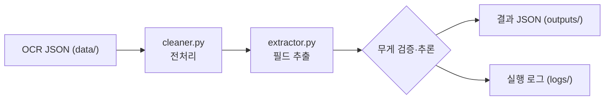

# reco-ocr-parser

계근지(차량 중량/공차/실중량 등을 포함한 영수증 형태)의 OCR 텍스트를 받아 업무에 필요한 필드를 정확하고 견고하게 파싱해 구조화 JSON으로 저장하는 파이프라인입니다.

## TL;DR (빠른 실행)

로컬에서 바로 재현하려면:

```bash
# Git Bash (추천)
python -m venv venv
source venv/Scripts/activate
pip install -r requirements.txt
python main.py

# 결과 확인
cat outputs/sample_01_result.json
```

PowerShell을 쓰는 경우:

```powershell
python -m venv venv
venv\Scripts\Activate.ps1
pip install -r requirements.txt
python .\main.py
```

테스트 실행:

```bash
python -m pytest tests/ -v
```

## 프로젝트 구조

```
reco-ocr-parser/
├─ main.py                     # 파이프라인 실행 진입점
├─ requirements.txt            # 의존성 목록
├─ data/                       # OCR 원본 JSON (입력, text 필드 사용)
│  ├─ sample_01.json
│  ├─ sample_02.json
│  ├─ sample_03.json
│  └─ sample_04.json
├─ src/
│  ├─ parser/
│  │  ├─ __init__.py
│  │  ├─ cleaner.py            # 전처리(노이즈/치환/공백 정규화)
│  │  ├─ extractor.py          # 필드 추출·검증 핵심 로직
│  │  └─ rules.py              # 라벨/정규식/주소 접두 규칙
│  └─ utils/
│     ├─ __init__.py
│     └─ formatter.py          # 숫자 병합, 노이즈 판정 유틸
├─ tests/
│  ├─ __init__.py
│  ├─ test_cleaner.py
│  └─ test_extractor.py
├─ outputs/                    # 파싱 결과 JSON (출력)
│  ├─ sample_01_result.json
│  ├─ sample_02_result.json
│  ├─ sample_03_result.json
│  └─ sample_04_result.json
└─ logs/
   └─ pipeline.log             # 실행 로그
```

## 환경 및 의존성

- Python: 3.10 이상(개발·검증은 3.10.11)
- OS: Windows / macOS / Linux

필수 패키지(버전은 `requirements.txt` 기준):

| 패키지   | 버전   | 용도                           |
|---------|--------|--------------------------------|
| spacy   | 3.7.2  | 확장용 NLP(현재 파이프라인은 비필수) |
| pandas  | 2.1.3  | 데이터 처리(필요 시)            |
| pydantic| 2.5.2  | 스키마 검증(필요 시)            |
| pytest  | 7.4.3  | 단위 테스트                    |

메모: 현 파이프라인은 정규식/룰 기반으로 동작하며 spaCy는 확장 시 사용 가능합니다.

## 입력/출력 스키마

- 입력(JSON): `data/*.json` – 최소 `text` 필드를 포함

```json
{
  "text": "계량일자: 2026-02-02 ...\n총중량 13 460 kg\n차중량 7 560 kg\n순중량 5 900 kg"
}
```

- 출력(JSON): `outputs/*.json`

```json
{
  "car_number": "0580",
  "date": "2025-12-01",
  "issuer_name": "(주)예시발급처",
  "issuer_address": "경기도 ○○시 △△로 2960-19",
  "client_name": "예시거래처",
  "weights": { "total": 14230, "empty": 12910, "net": 1320 }
}
```

규칙
- 날짜는 `YYYY-MM-DD`로 정규화(`YYYY.MM.DD`도 허용).
- 무게 단위는 kg로 가정, 콤마·공백 분리 숫자 지원(예: `13 460 kg` → `13460`).
- 필드 미추출 시 문자열은 `"N/A"`, 숫자는 `0`.

## 설계 개요(Design)

파이프라인: cleaner → extractor → 검증/추론 → 저장/로그

- cleaner (`src/parser/cleaner.py`)
  - 특수기호 제거(`*` 등), 흔한 OCR 오인식 치환, 다중 공백 정규화.
- utils (`src/utils/formatter.py`)
  - `merge_split_number_kg`: 공백으로 분리된 숫자+kg 병합.
  - `is_noise_line`: 날짜/시간/좌표/무게 등 노이즈 라인 필터.
  - `extract_number_value`: 한 줄의 수치(우선 ‘NNN kg’) 추출.
- extractor (`src/parser/extractor.py`)
  - 날짜: `DATE_LABELS` 감지 → 정규식(`DATE_REGEX`)으로 추출·정규화.
  - 차량번호: `CAR_LABELS`/`CAR_PART_HINTS` 토큰 스캔, 부가어(입고/출고) 제외.
  - 고객명: `CLIENT_LABELS` 라벨 절취 → 보조 절취 → `귀하` 패턴.
  - 중량: 라벨 매칭(총/공차/차/순) + 임시 중량값 보관 → `_infer_weights`로 누락 보정.
  - 발급처: `(주)`·`주식회사` 힌트 라인 탐색, 노이즈/중복 제거 → 하단 5줄 휴리스틱.
  - 주소: 광역 지자체 접두(`ADDRESS_PREFIX_PATTERN`) 매칭 1줄 채택.
- rules (`src/parser/rules.py`)
  - 라벨/힌트/정규식 및 주소 접두 규칙 중앙 관리.
- main (`main.py`)
  - `data/*.json` 순회 → 전처리/추출 → 무게 일관성 경고 → `outputs/*.json` 저장, `logs/pipeline.log` 기록.

## 주요 가정(Assumptions)

- 입력 OCR 텍스트는 줄바꿈 기준으로 의미 단위가 어느 정도 유지됨.
- 무게 단위는 kg이며, 문서 1건당 총/공차/순의 합산 규칙이 성립.
- 발급처는 `(주)` 또는 `주식회사`가 포함된 라인/문장으로 식별 가능.
- 주소는 광역 지자체명으로 시작하는 1개 라인으로 기재됨.

## 한계 및 개선 아이디어

- 주소가 2줄 이상인 문서: 현재는 첫 매칭 1줄만 추출. → 다줄 병합 로직 추가.
- 단위 다양성: kg 이외 단위 미지원. → 단위 파싱/변환 추가.
- 발급처/고객명 충돌: 특정 포맷에서 혼동 가능. → 라벨 사전 확장 및 음수 규칙 강화.
- 규칙 커버리지: 기관/지역 라벨 변형 추가 필요 시 `rules.py` 확장.
- 좌표/시간 노이즈: 현재 휴리스틱. → bounding box(좌표) 활용한 레이아웃 기반 추출로 정밀화.
- spaCy/NER: 비정형 문서 대응력 향상을 위해 조직/주소 엔티티 인식 추가 고려.

## 로깅 및 재현

- 모든 실행 로그는 `logs/pipeline.log`에 기록됩니다.
- 재현 절차: venv 생성 → 의존성 설치 → `python main.py` → `outputs/*.json`/`logs/pipeline.log` 확인.

## 테스트

단위 테스트는 `pytest` 기반이며 중량 파싱, 날짜 정규화, 차량/고객/발급처 추출을 커버합니다.

```bash
python -m pytest tests/ -v
```

## NLP 보조 모드 (옵션)

기본 결과는 그대로 유지하고, 비어 있는 발급처/주소/거래처만 spaCy(EntityRuler)로 보조 추출할 수 있습니다.

- 기본값: OFF (아무 영향 없음)
- 활성화 방법:

Git Bash
```bash
USE_NLP=1 python main.py
```

PowerShell
```powershell
$env:USE_NLP = '1'
python .\main.py
```

설치가 필요하면: `pip install -r requirements.txt` (spaCy 3.7.2)

## 처리 흐름(Flow)


