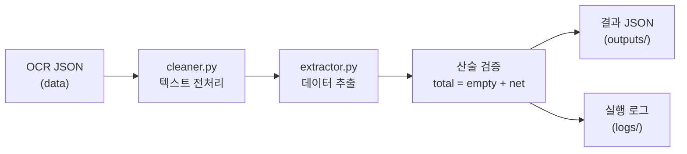

# reco-ocr-parser

계근지(차량 중량 영수증) OCR 결과 텍스트를 파싱하여 구조화된 데이터(JSON)로 변환하는 프로젝트입니다.

## 프로젝트 구조

```
reco-ocr-parser/
├── main.py                  # 파이프라인 실행 진입점
├── requirements.txt         # 의존성 목록
├── data/                    # OCR 원본 JSON (입력)
│   ├── sample_01.json
│   ├── sample_02.json
│   ├── sample_03.json
│   └── sample_04.json
├── src/
│   └── parser/
│       ├── cleaner.py       # 텍스트 전처리 (노이즈 제거)
│       └── extractor.py     # 데이터 추출 및 검증
├── tests/
│   ├── test_cleaner.py      # cleaner 단위 테스트
│   └── test_extractor.py    # extractor 단위 테스트
├── outputs/                 # 파싱 결과 JSON (출력)
│   ├── sample_01_result.json
│   ├── sample_02_result.json
│   ├── sample_03_result.json
│   └── sample_04_result.json
└── logs/                    # 실행 로그
    └── pipeline.log
```

## 실행 환경

- **Python**: 3.10 이상
- **OS**: Windows / macOS / Linux

## 설치 및 실행

```bash
# 1. 저장소 클론
git clone <저장소 URL>
cd reco-ocr-parser

# 2. 가상환경 생성 및 활성화
python -m venv venv

# Windows
venv\Scripts\activate
# macOS/Linux
source venv/bin/activate

# 3. 의존성 설치
pip install -r requirements.txt

# 4. 파이프라인 실행
python main.py

# 5. 테스트 실행
python -m pytest tests/ -v
```

### 실행 결과 확인

- 파싱 결과: `outputs/sample_XX_result.json`
- 실행 로그: `logs/pipeline.log`

## 설계 및 주요 가정

### 파이프라인 흐름



### 1단계: 텍스트 전처리 (`cleaner.py`)

OCR 결과에는 다양한 노이즈가 포함되어 있어, 추출 전 정제를 수행합니다.

| 노이즈 유형 | 예시 | 처리 |
|---|---|---|
| 오탈자 | "계 그 표" | "계량증명표"로 교정 |
| 중복 텍스트 | "입 고입고" | "입고"로 통합 |
| 무의미한 문자열 | "공육을 unle" | 제거 |
| 특수문자 | `***` | 제거 |
| 불규칙 공백 | "총중량:  13460" | 단일 공백으로 정규화 |

### 2단계: 데이터 추출 (`extractor.py`)

**숫자 분리 병합 전략**

OCR이 숫자를 공백으로 분리하는 문제(예: `13 460 kg`)에 대응합니다.
시간값(`02:07`)과 무게값(`13 460`)이 같은 줄에 존재하므로,
`숫자-공백-숫자-kg` 패턴만 선별하여 병합합니다.

```
원본: "총중량: 02:07 13 460 kg"
전처리: "총중량: 02:07 13460kg"
추출: 13460
```

**키워드 기반 필드 매핑**

공백이 제거된 키워드로 매칭하여, 띄어쓰기 변형("총 중 량", "총중량")에 모두 대응합니다.

| 키워드 | 매핑 필드 |
|---|---|
| 총중량 | `weights.total` |
| 공차중량, 차중량 | `weights.empty` |
| 실중량, 순중량 | `weights.net` |

### 3단계: 산술 검증 및 추론

`총중량 = 공차중량 + 실중량` 관계를 이용하여 누락된 값을 추론합니다.

| 확보된 값 | 추론 |
|---|---|
| total + empty | net = total - empty |
| empty + net | total = empty + net |
| total + net | empty = total - net |

### 주요 가정

- 입력은 OCR API의 JSON 응답이며, `text` 필드에 전체 텍스트가 포함되어 있습니다.
- 무게 단위는 `kg`입니다.
- 날짜는 `YYYY-MM-DD` 또는 `YYYY.MM.DD` 형식입니다.
- 하나의 JSON 파일에 하나의 계근지 데이터가 포함됩니다.

## 결과 산출물 예시

`outputs/sample_02_result.json`:

```json
{
    "car_number": "80구8713",
    "date": "2026-02-02",
    "weights": {
        "total": 13460,
        "empty": 7560,
        "net": 5900
    }
}
```

## 테스트

pytest 기반 단위 테스트 23개 케이스를 포함합니다.

```bash
python -m pytest tests/ -v
```

| 테스트 파일 | 케이스 수 | 검증 내용 |
|---|---|---|
| `test_cleaner.py` | 8개 | 오탈자 교정, 특수문자 제거, 공백 정규화 |
| `test_extractor.py` | 15개 | 중량 파싱, 산술 추론, 날짜/차량번호 추출 |

## Troubleshooting: OCR 숫자 분리 이슈

개발 과정에서 가장 까다로웠던 문제와 해결 과정을 기록합니다.

### 문제

OCR이 하나의 숫자를 공백으로 분리하여 인식하는 현상이 발생했습니다.
같은 줄에 시간값과 무게값이 혼재하여, 단순 숫자 추출로는 구분이 불가능했습니다.

```
OCR 원본: "총중량: 02:07 13 460 kg"
                  ─────  ──────
                  시간값   무게값(13,460)
```

기존 정규식 `\d{1,3}(?:,\d{3})*`은 콤마 구분 숫자만 대응하여,
병합된 `13460kg`에서 뒷자리 `460`만 캡처하는 버그가 발생했습니다.

```
잘못된 결과: total=460, empty=560, net=900
```

### 해결

**1단계 - 전처리**: `숫자-공백-숫자-kg` 패턴을 감지하여 공백을 제거합니다.

```python
re.sub(r'(\d+)\s+(\d+)\s*kg', r'\1\2kg', text)
# "13 460 kg" → "13460kg"
# "02:07"은 kg가 없으므로 영향 없음
```

**2단계 - 정규식 확장**: `\d{1,3}` → `\d+`로 변경하여 자릿수 제한을 제거합니다.

```python
re.search(r'(\d+(?:,\d{3})*)\s*kg', line)
# "13460kg" → 13460 캡처 성공
```

```
수정된 결과: total=13460, empty=7560, net=5900
검증: 13460 - 7560 = 5900 ✓
```

## 한계 및 개선 아이디어

### 한계

- 오탈자 교정이 하드코딩된 사전 방식이라 새로운 OCR 노이즈 패턴에 대한 수동 추가가 필요합니다.
- 차량번호 추출이 라벨 키워드에 의존하여, 라벨이 완전히 누락된 경우 추출이 불가합니다.
- 4개 샘플에 대해서만 검증되었으며, 다양한 계근지 양식에 대한 범용성은 미확인입니다.

### 개선 아이디어

- **오탈자 교정**: 하드코딩 사전 대신 편집 거리(Levenshtein distance) 기반 유사도 매칭으로 확장
- **NER 활용**: spaCy 등 NLP 엔진의 개체명 인식(Named Entity Recognition)으로 라벨 없이도 차량번호/날짜를 추출
- **좌표 기반 파싱**: OCR 응답의 bounding box 좌표를 활용하여 시간값과 무게값을 공간적으로 분리
- **CSV 출력 지원**: 다건 처리 시 결과를 하나의 CSV 파일로 집계하여 출력

## 의존성

| 패키지 | 버전 | 용도 |
|---|---|---|
| spacy | 3.7.2 | NLP 엔진 (확장용) |
| pandas | 2.1.3 | 데이터 처리 (확장용) |
| pydantic | 2.5.2 | 데이터 검증 (확장용) |
| pytest | 7.4.3 | 단위 테스트 |
